Programming and Data Science Cheat Sheets List
===========

---

As the name suggests, this repository presents a list of cheat sheets on programming and data science.

---
# Table of Contents

<!-- MarkdownTOC autolink="true" levels="2,3" -->

- [Multi-Domain Site Cheatsheets](#multi-domain-site-cheatsheets)
	- [devhints.io \(Rico's cheatsheets\)](#devhintsio-ricos-cheatsheets)
	- [Guif.re](#guifre)
	- [Quickref](#quickref)
	- [Learnxinyminutes](#learnxinyminutes)
	- [shortcutfoo \(Learn shortcuts\)](#shortcutfoo-learn-shortcuts)
- [Multi-Domain Repositories Cheatsheets](#multi-domain-repositories-cheatsheets)
	- [Awesome Cheat Sheets \(LeCoupa\)](#awesome-cheat-sheets-lecoupa)
	- [Awesome Cheat Sheet \(detailyang\)](#awesome-cheat-sheet-detailyang)
- [Javascript Cheatsheet](#javascript-cheatsheet)
	- [ES6 Cheat Sheet \(ECMAScript 2015\)](#es6-cheat-sheet-ecmascript-2015)
	- [Modern JavaScript Cheatsheet](#modern-javascript-cheatsheet)
	- [React Typescript Cheatsheet](#react-typescript-cheatsheet)
- [Data Science Cheatsheets](#data-science-cheatsheets)
	- [Computer Science Cheatsheet](#computer-science-cheatsheet)
	- [Data Science Cheatsheets](#data-science-cheatsheets-1)
	- [Essential Cheat Sheets for Machine Learning and Deep Learning Engineers](#essential-cheat-sheets-for-machine-learning-and-deep-learning-engineers)
- [Python Cheatsheet](#python-cheatsheet)
	- [Comprehensive Python Cheatsheet](#comprehensive-python-cheatsheet)
	- [Official Matplotlib cheat sheets](#official-matplotlib-cheat-sheets)
	- [Pythoncheatsheet](#pythoncheatsheet)

<!-- /MarkdownTOC -->

## Multi-Domain Site Cheatsheets

### [devhints.io](https://devhints.io/) (Rico's cheatsheets)
- Analytics
- Ansible
- Apps
- C-like
- CLI
- CSS
- Databases
- Devops
- Elixir
- Git
- HTML
- Java & JVM
- JavaScript
- JavaScript libraries
- Jekyll
- Ledger
- Markup
- macOS
- Node.js
- PHP
- Python
- Rails
- React
- Ruby
- Ruby libraries
- Vim
- Fitness
- Others

##### Example :
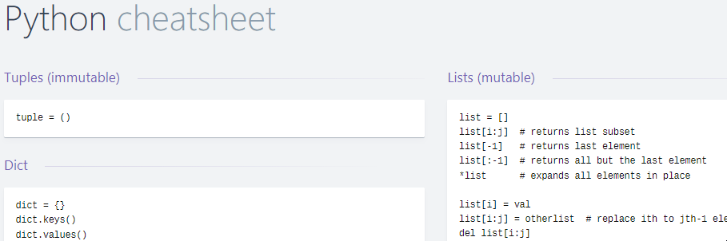

[(back to table of contents)](#table-of-contents)

### [Guif.re](https://guif.re/) 
**Notes of Guifre Ruiz**

##### Example :
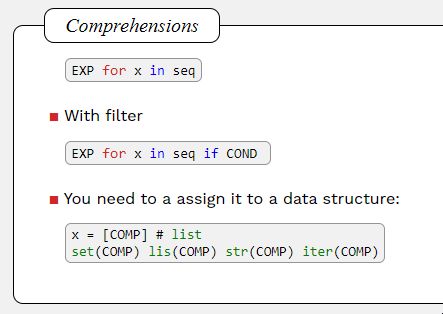

[(back to table of contents)](#table-of-contents)

### [Quickref](https://quickref.me/)
- Programming
- Toolkit
- Linux Command
- Python
- Database
- Keyboard Shortcuts
- Other

##### Example :
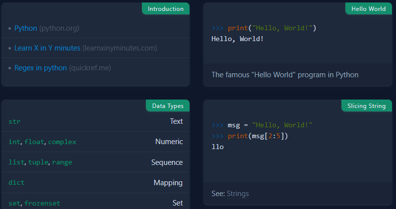

[(back to table of contents)](#table-of-contents)

### [Learnxinyminutes](https://learnxinyminutes.com/)
- Algorithms & Data Structures
- Languages
- Tools

**Ressources in fr-fr**

##### Example :

[(back to table of contents)](#table-of-contents)

### [shortcutfoo](https://www.shortcutfoo.com/) (Learn shortcuts)

##### Example :
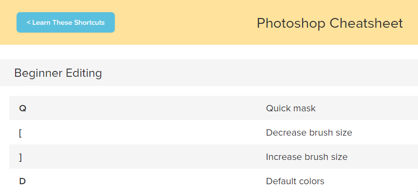

[(back to table of contents)](#table-of-contents)

---
## Multi-Domain Repositories Cheatsheets

### [Awesome Cheat Sheets](https://lecoupa.github.io/awesome-cheatsheets/) (LeCoupa)

###### Awesome cheatsheets for popular programming languages, frameworks and development tools

- Languages
- Backend
- Frontend
- Databases
- Tools

##### Example :
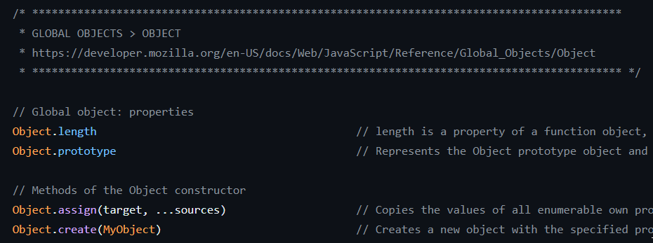

[(back to table of contents)](#table-of-contents)

### [Awesome Cheat Sheet](https://github.com/detailyang/awesome-cheatsheet) (detailyang)

###### Regroup plenty of this Cheat Sheets of multiple domain

- Platforms
- Programming Languages
- Software Testing
- Front-End Development
- Back-End Development
- Big Data
- Theory
- Editors
- Tools
- Databases
- Media
- Security
- Project Management
- Miscellaneous

[(back to table of contents)](#table-of-contents)

---
## Javascript Cheatsheet

### [ES6 Cheat Sheet (ECMAScript 2015)](https://slides.com/drksephy/ecmascript-2015)

##### Example :
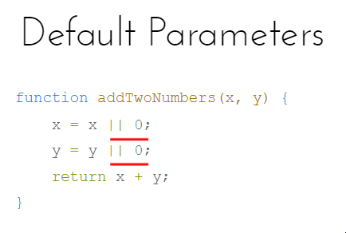

[(back to table of contents)](#table-of-contents)

### [Modern JavaScript Cheatsheet](https://mbeaudru.github.io/modern-js-cheatsheet/)

##### Example :
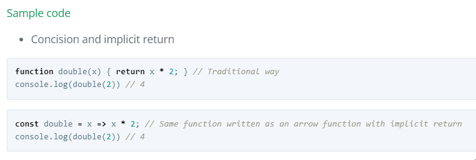

[(back to table of contents)](#table-of-contents)

### [React Typescript Cheatsheet](https://react-typescript-cheatsheet.netlify.app/)

##### Example :
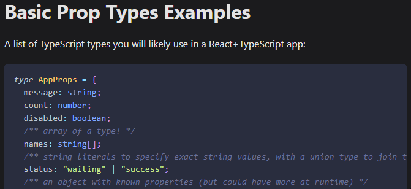

[(back to table of contents)](#table-of-contents)

---
## Data Science Cheatsheets

### [Computer Science Cheatsheet](https://stanford.edu/~shervine/teaching/)
- Artificial Intelligence
- Machine Learning
- Deep Learning
- Computational and Mathematical Engineering

##### Example :
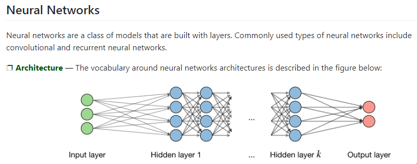

[(back to table of contents)](#table-of-contents)

### [Data Science Cheatsheets](https://github.com/FavioVazquez/ds-cheatsheets)

###### Includes plenty of site like Datacamp

- Business Science
- Python
- R
- Math and Calculus
- Big Data
- Machine Learning
- Deep Learning
- SQL
- Data Visualization
- Data Science in General and Others
- Data Science Cheatsheet Takeaway

##### Example :
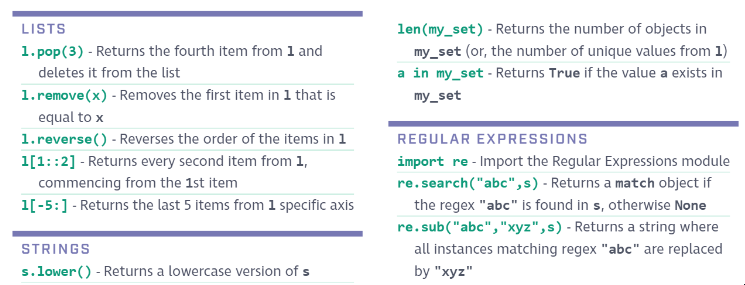

[(back to table of contents)](#table-of-contents)

### [Essential Cheat Sheets for Machine Learning and Deep Learning Engineers](https://startupsventurecapital.com/essential-cheat-sheets-for-machine-learning-and-deep-learning-researchers-efb6a8ebd2e5)

###### [Source : ](https://www.datacamp.com/cheat-sheet)

- Keras
- Numpy
- Pandas
- Scipy
- Matplotlib
- Scikit-learn
- Neural Networks Zoo
- ggplot2
- PySpark
- R Studio
- Jupyter Notebook
- Dask

##### Example :
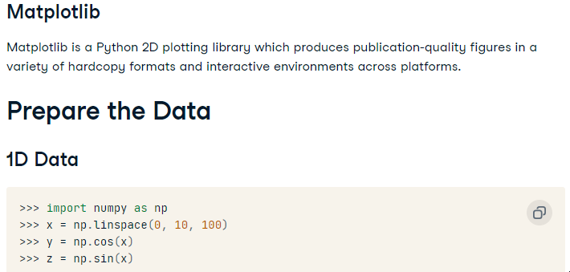

[(back to table of contents)](#table-of-contents)

---
## Python Cheatsheet

### [Comprehensive Python Cheatsheet](https://gto76.github.io/python-cheatsheet/)

##### Example :
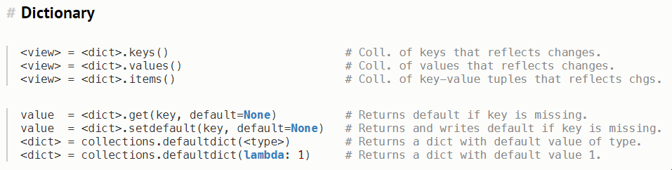

[(back to table of contents)](#table-of-contents)

### [Official Matplotlib cheat sheets](https://github.com/matplotlib/cheatsheets)

#### Fichier : 
[Matplotlib Cheatsheets PDF](assets/matplotlib.pdf)

[Matplotlib Handout beginner PDF](assets/matplotlib-handout-beginner.pdf)

[Matplotlib Intermediate handout PDF](assets/matplotlib-handout-intermediate.pdf)

[Matplotlib Tips handout PDF](assets/matplotlib-handout-tips.pdf)

##### Example :
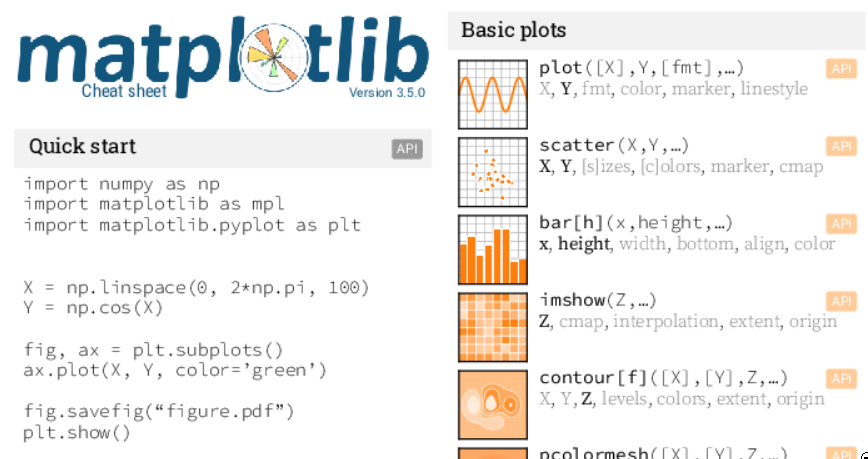

[(back to table of contents)](#table-of-contents)

### [Pythoncheatsheet](https://www.pythoncheatsheet.org/)

##### Example :
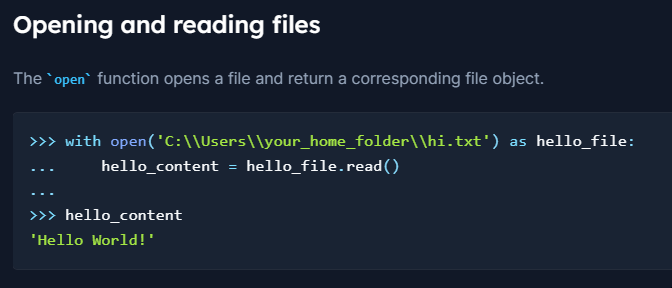

[(back to table of contents)](#table-of-contents)

